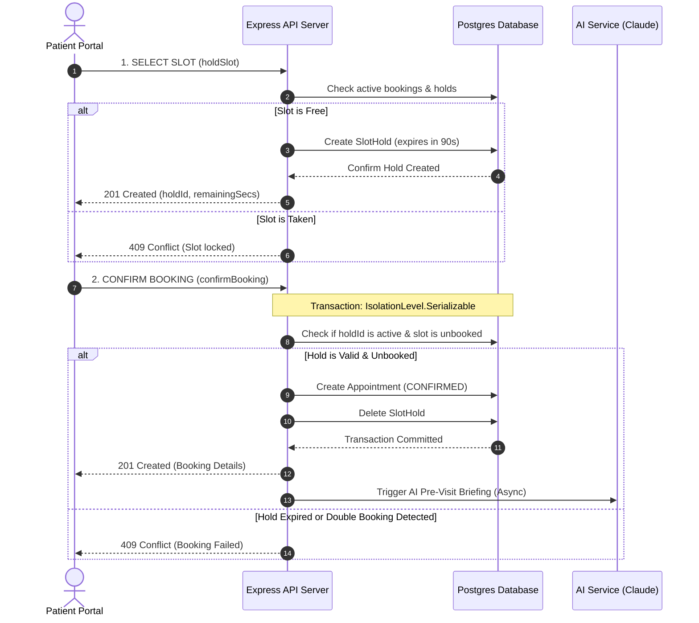
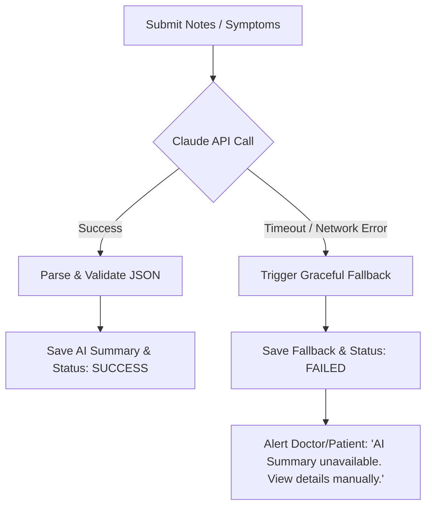

# MediSync — System Design & Architecture

This document describes the architectural specifications, system workflows, and design patterns implemented in **MediSync**.

---

## 1. Concurrency-Safe Appointment Booking Model

To prevent double-bookings under concurrent checkout actions, MediSync utilizes a **Dual-Phase Locking Pattern**:

### Phase 1: Expirable Slot Hold
When a patient selects a slot, the system creates a entry in the `SlotHold` table with an expiration timestamp of `now() + 90 seconds`.
- If another patient attempts to lock or book the same slot, the availability check fails, returning a `409 Conflict` (slot temporarily locked).
- An interval-based background sweeper sweeps the database every 60 seconds to prune expired holds, restoring slots back into the available pool if checkout is abandoned.

### Phase 2: Serializable Transactional Confirmation
When the patient submits their symptom intake details to confirm booking, the transaction is run inside `prisma.$transaction` at a `Serializable` isolation level.
- It checks that the hold remains active and hasn't expired.
- It verifies that no concurrent database commit has finalized an active booking on that exact slot start time.
- If a conflict is discovered, it rolls back the transaction safely, returning a `409 Conflict` prompting the patient to refresh the schedule.

---

## 2. LLM Summary Pipeline & Resilience Pattern

MediSync leverages the **Anthropic Claude model (claude-3-5-sonnet)** for analyzing symptoms (pre-visit) and clinical consultations (post-visit).

### Flow Architecture
1. **Intake Stage (Pre-Visit)**: Converts raw patient symptoms into structured insights: chief complaint, urgency tier (`Low`, `Medium`, `High`), and 3 targeted questions to guide the doctor.
2. **Consultation Stage (Post-Visit)**: Translates complex clinical jargon notes and prescription details into a plain-language summary and creates structured daily medication timers for the patient.

### Graceful Degradation (Fail-Safe)
To protect patient checkout and diagnosis submissions, the LLM pipeline is isolated inside try-catch structures:
- If the Anthropic API times out, fails, or credentials are missing/invalid, the system records `status: FAILED` in the summary table.
- A user-friendly fallback is stored (e.g. `"Summary unavailable — please review symptoms manually"`), ensuring the checkout or consultation completes without interruption.

---

## 3. Background Job Queue & Sweepers

MediSync splits background work into two categories for reliability:

1. **Transactional Message Queue (BullMQ + Redis)**:
   - All email notifications (booking confirmations, cancellations, and doctor leaves) are logged in the `EmailLog` table and queued in the `email-queue`.
   - BullMQ workers process the queue asynchronously with exponential backoff retries (3 attempts).
   - If Redis is disconnected, the system falls back to immediate SMTP dispatch to prevent notification drop-outs.

2. **Database Sweepers (Interval-Based)**:
   - **Pruning Holds**: Runs every 1 minute to purge expired slot holds.
   - **Medication Reminders**: Checks every 1 minute for active medication logs whose scheduled time has passed, sending reminder notifications.
   - **Upcoming Visit Reminders**: Sweeps every 10 minutes to locate appointments starting in 24 hours or 1 hour, dispatching reminder emails.
